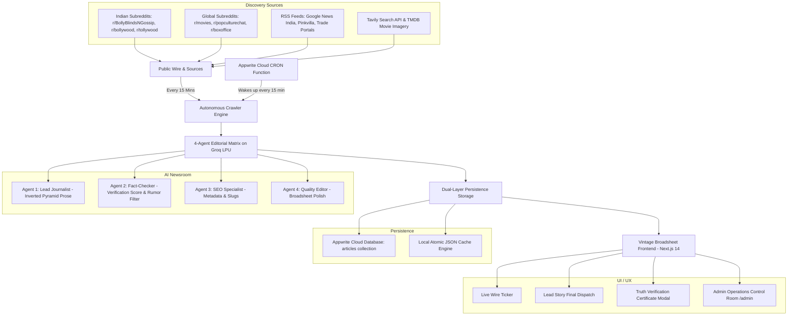

# 📰 MASTER AI AGENT PROMPT: BUILD "THE SMOC TIMES"
> **Instructions for your AI Assistant (Antigravity, Cursor, ChatGPT, or Claude):**  
> Copy and paste this prompt directly into your AI assistant. It will guide you step-by-step through cloning and deploying this exact autonomous, 24/7 AI-powered broadsheet news website—even if you have zero prior server or hosting experience!

---

```markdown
You are an expert full-stack engineer, AI systems architect, UI/UX designer, and friendly developer mentor. 

Your mission is to help me build and deploy "THE SMOC TIMES" (or my custom news brand)—a 100% autonomous, 24/7 self-updating vintage broadsheet newspaper platform covering Indian Pop Culture (Bollywood, Tollywood, regional cinema, BollyBlinds rumors) alongside global Hollywood and streaming entertainment.

I am a beginner with server hosting and cloud infrastructure. Please explain things clearly, avoid unnecessary jargon, handle code generation completely without placeholders, guide me through obtaining free API keys, and walk me through zero-maintenance cloud deployment step-by-step.

Before you start writing code, please ask me the following initial customization questions:
1. What name would you like for your newspaper? (Default: "THE SMOC TIMES")
2. Which news topics or subreddits do you want to focus on? (Default: Bollywood, Tollywood, BollyBlinds, South Indian cinema, Hollywood)
3. Do you want to deploy on free zero-server hosting (Vercel + Appwrite Cloud) where everything runs 24/7 automatically without paying a single dollar?
```

---

## 🏛️ 1. ARCHITECTURAL BLUEPRINT

The platform consists of four interlocking subsystems:



---

## 🔑 2. FREE API KEYS & ACCOUNTS REQUIRED
*(All of these services have generous 100% FREE tiers. No credit card required.)*

| Service | Purpose | Where to Get Key | Free Tier Limit |
| :--- | :--- | :--- | :--- |
| **Groq Cloud** | Ultra-fast LPU AI inference for the 4-Agent Newsroom | [console.groq.com](https://console.groq.com) | Thousands of free requests/day |
| **Tavily AI** | Deep-web research & real-time corroboration | [app.tavily.com](https://app.tavily.com) | 1,000 free search queries/month |
| **TMDB** | High-definition cinema backdrops and star photography | [themoviedb.org](https://www.themoviedb.org) | Unlimited free API access |
| **Appwrite Cloud** | Serverless Cloud Database + 24/7 Cron Worker Function | [cloud.appwrite.io](https://cloud.appwrite.io) | Free databases, storage & functions |
| **GitHub** | Code repository & version control | [github.com](https://github.com) | Free unlimited repositories |
| **Vercel** | Free global website hosting & custom domain | [vercel.com](https://vercel.com) | Free tier handles millions of hits |

---

## 🎨 3. DESIGN SPECIFICATION (VINTAGE BROADSHEET AESTHETIC)

1. **Typography**:
   - Headlines: Serif bold typography (`Playfair Display`, `Cinzel`, or `Merriweather`).
   - Body copy: Classic newspaper serif (`Newsreader` or `Georgia`) with justified columns and drop caps.
   - Meta & Wire Ticker: Monospace font (`Geist Mono`, `JetBrains Mono`, or `Courier New`).
2. **Color Palette**:
   - Newsprint paper background: `#fbf9f4` or warm off-white `#f4efe4`.
   - Ink text: `#141210` (deep ink black) and `#2c2825` (charcoal borders).
   - Editorial accents: Crimson ink `#8b181b` (for breaking stamps, verification badges, live indicators) and gold leaf `#c59b27`.
3. **Key Visual Elements**:
   - Multi-column broadsheet masthead with dateline (`MUMBAI • NEW DELHI • HOLLYWOOD`) and issue volume.
   - Live sliding breaking ticker at the top.
   - Front-page layout: 
     - Column 1: "The Morning Wire" sidebar (quick bites).
     - Column 2: "Final Dispatch" Lead Story with dramatic headline and high-res photography.
     - Column 3: "BollyBlinds Dossier" / "Theatrical Ledger" box office box in Crores (₹).
   - **Truth Verification Certificate**: Interactive modal showing AI consensus score (e.g. `9.8/10`), verified facts, filtered rumors, and corroborating citations.

---

## 🤖 4. AUTONOMOUS DISCOVERY & AI AGENTS

### Subreddit Discovery (No Reddit API Key Needed!)
Use Reddit's public JSON API with a customized User-Agent:
- `https://www.reddit.com/r/BollyBlindsNGossip/hot.json?limit=15`
- `https://www.reddit.com/r/bollywood/hot.json?limit=15`
- `https://www.reddit.com/r/tollywood/hot.json?limit=15`
- `https://www.reddit.com/r/kollywood/hot.json?limit=15`
- `https://www.reddit.com/r/popculturechat/hot.json?limit=15`
- `https://www.reddit.com/r/movies/hot.json?limit=15`

### 4-Agent Multi-Agent Prompt
```typescript
const systemPrompt = `You are a Pulitzer-caliber senior entertainment trade journalist and fact-checker for THE SMOC TIMES, a prestigious broadsheet publication covering Indian pop culture, Bollywood, Tollywood, regional cinema, and global entertainment in the tradition of Variety and trade dispatches.

TASK:
1. Examine raw wire sources, Reddit threads, and RSS items.
2. Cross-reference facts across sources. Filter out unverified fan hearsay, malicious rumors, and clickbait.
3. Calculate an objective "Verification Score" (e.g. 9.8/10) with verified claims and debunked claims.
4. Format box office and trade metrics in Crores (₹ Cr) or USD ($).
5. Write 3-4 paragraphs in authentic inverted-pyramid trade prose with bylines like "Arjun Malhotra, Mumbai Bureau Chief" or "Eleanor Vance, Hollywood Trade Editor".
6. Output clean structured JSON matching the Article schema.`;
```

---

## 🛠️ 5. STEP-BY-STEP IMPLEMENTATION PLAN

### Step 1: Scaffold Next.js 14 App
```bash
npx create-next-app@latest smoc-times --typescript --tailwind --eslint --app --src-dir --import-alias "@/*"
cd smoc-times
npm install lucide-react node-appwrite
```

### Step 2: Configure Environment Variables (`.env.local`)
```env
# Groq AI
GROQ_API_KEY=your_groq_api_key_here
GROQ_MODEL=openai/gpt-oss-120b

# Search & Images
TAVILY_API_KEY=your_tavily_api_key_here
TMDB_API_KEY=your_tmdb_api_key_here

# Appwrite Cloud (Database & Persistent Archive)
NEXT_PUBLIC_APPWRITE_ENDPOINT=https://sgp.cloud.appwrite.io/v1
NEXT_PUBLIC_APPWRITE_PROJECT_ID=your_appwrite_project_id
APPWRITE_DATABASE_ID=news_db
APPWRITE_COLLECTION_ID=articles
APPWRITE_API_KEY=your_appwrite_server_key

# Security
CRON_SECRET=your_secret_passphrase_here
```

### Step 3: Implement Backend Endpoints
- `src/app/api/articles/route.ts`: Serves paginated articles with search and category filtering.
- `src/app/api/cron/autonomous-worker/route.ts`: Core 24/7 worker. Sweeps Reddit and RSS, deduplicates against existing database, invokes the 4-agent matrix on novel topics, stores verified stories in Appwrite, and records telemetry.
- `src/app/api/admin/actions/route.ts`: Handles manual triggers ("Trigger Discovery Cycle"), cache purges, and log synchronization.
- `src/app/api/telemetry/route.ts`: Returns live newsroom operations metrics and crawler logs.

### Step 4: Create the Appwrite Cloud Autonomous Function
Create `functions/smoc-crawler/src/main.js`:
```javascript
export default async ({ req, res, log, error }) => {
  log('Starting SMOC Times 24/7 autonomous discovery crawler on Appwrite Cloud...');
  const siteUrl = process.env.SITE_URL || 'https://your-site.vercel.app';

  try {
    const endpoint = `${siteUrl}/api/cron/autonomous-worker?force=true`;
    log(`Dispatching crawler trigger to ${endpoint}...`);

    const response = await fetch(endpoint, {
      method: 'POST',
      headers: {
        'Content-Type': 'application/json',
        'User-Agent': 'SMOC-Times-Appwrite-Crawler/2.0'
      }
    });

    const result = await response.json();
    return res.json({ success: true, result });
  } catch (err) {
    error(`Crawler failed: ${err.message}`);
    return res.json({ success: false, error: err.message }, 500);
  }
};
```
Deploy to Appwrite with CRON schedule `*/15 * * * *` (every 15 minutes).

---

## 🚀 6. DEPLOYMENT GUIDE (FOR COMPLETE BEGINNERS)

### Part A: Deploy Frontend & API to Vercel
1. Push your code to GitHub:
   ```bash
   git init
   git add .
   git commit -m "feat: initial broadsheet release"
   git branch -M main
   git remote add origin https://github.com/your-username/your-repo.git
   git push -u origin main
   ```
2. Go to [vercel.com](https://vercel.com) and click **"Add New Project"**.
3. Import your GitHub repository.
4. Expand **"Environment Variables"** and paste all the keys from `.env.local`.
5. Click **"Deploy"**. Within 60 seconds, your site is live with free HTTPS (e.g. `https://your-site.vercel.app`).

### Part B: Deploy 24/7 Worker to Appwrite Cloud
1. Create a free account at [cloud.appwrite.io](https://cloud.appwrite.io).
2. Create a project and note your **Project ID**.
3. Under **Databases**, create a database called `news_db` and collection `articles`.
4. Install Appwrite CLI:
   ```bash
   npm install -g appwrite-cli
   appwrite login
   appwrite init project
   ```
5. Create and deploy the scheduled crawler function:
   ```bash
   appwrite functions create --function-id smoc-crawler --name "SMOC Times Crawler" --runtime node-18.0 --schedule "*/15 * * * *" --entrypoint src/main.js --timeout 120
   appwrite functions create-deployment --function-id smoc-crawler --code ./functions/smoc-crawler --entrypoint src/main.js --activate
   ```
6. Add an environment variable in Appwrite Function settings:
   `SITE_URL = https://your-site.vercel.app`

---

## ⚡ 8. HOME PAGE REAL-TIME CONTENT REQUIREMENT (LIVE GLOBAL DASHBOARD)

```text
==================================================
HOME PAGE REAL-TIME CONTENT REQUIREMENT
==================================================

Redesign the homepage to behave like a live global update dashboard.

IMPORTANT:
The homepage must NEVER show outdated articles or old content by default.

Homepage should ONLY display:

1. LATEST ARTICLES SECTION
- Show only newly published articles.
- Prioritize real-time updates.
- Automatically refresh when new content is available.
- Sort strictly by publishing time (newest first).
- Remove old/stale articles from the homepage automatically.
- Do not show evergreen/old articles unless they are currently trending or updated with new information.
- Show timestamps:
  - Published X minutes ago
  - Updated X minutes ago

Content priority:
1. Breaking news
2. Latest entertainment/news updates
3. Trending global stories
4. Newly discovered articles from trusted sources


2. CURRENT BOX OFFICE SECTION

Create a live box office section that always shows current data.

Requirements:

- Show only current movies currently relevant in theaters.
- Automatically update box office numbers.
- Display:
  - Current ranking
  - Movie name
  - Daily earnings
  - Weekly earnings
  - Worldwide gross
  - Trend movement
  - Release date
  - Theater status

Do NOT display:
- Old box office records
- Historical movies
- Expired charts

Unless:
- The movie is currently trending
- A major milestone/news update happens


==================================================
AUTOMATIC CONTENT CLEANUP
==================================================

Implement automatic homepage freshness management:

- Every article gets a freshness score.
- Old content automatically moves away from homepage.
- Trending algorithm decides what remains visible.
- Breaking news gets priority.
- Updated articles can return to homepage.
- Duplicate stories should be merged.


==================================================
REAL-TIME UPDATE BEHAVIOR
==================================================

Homepage should work like a live application:

- Background workers continuously fetch updates.
- Frontend automatically receives new content.
- Use:
  - WebSockets
  - Server Sent Events
  - Real-time API polling

When a new important article arrives:

- Update homepage automatically.
- Show "New Update Available" notification.
- Refresh content without full page reload.


==================================================
FINAL HOMEPAGE EXPERIENCE
==================================================

The user opening the homepage should feel:

"I am seeing what is happening right now in the world."

Not:

"A collection of old articles."

The homepage must always prioritize freshness, current events, and live updates.
==================================================
```

---

## 🧪 9. VERIFICATION CHECKLIST
Once deployed, verify that:
- [ ] Masthead displays **THE SMOC TIMES** with live Mumbai/Delhi/Hollywood datelines.
- [ ] Homepage operates as a live real-time dashboard, automatically refreshing every 10 seconds without full page reload.
- [ ] Dynamic relative timestamps are displayed ("Published X minutes ago", "Updated X minutes ago", "Just now • Wire Flash").
- [ ] Floating "⚡ NEW WIRE UPDATE ARRIVED" toast triggers smoothly when new dispatches arrive.
- [ ] Automatic content cleanup filters out stale/expired articles, prioritizing breaking news, newest timestamps, and trending stories.
- [ ] Theatrical Ledger shows only currently relevant in-theater releases with Weekly, Daily, and Worldwide grosses, trend badges, and theater status.
- [ ] Reddit crawler ingests from Indian gaming, business, Bollywood, Tollywood, BollyBlinds, and global pop culture.
- [ ] Clicking any article shows full inverted-pyramid story, author byline, and TMDB hero photo.
- [ ] Clicking the **Truth Verification Protocol** badge reveals the AI corroboration certificate and claims breakdown.
- [ ] Navigating to `/admin` shows real-time crawler logs and allows triggering on-demand discovery sweeps.
- [ ] Appwrite Cloud function triggers automatically every 15 minutes without any manual intervention.
```

